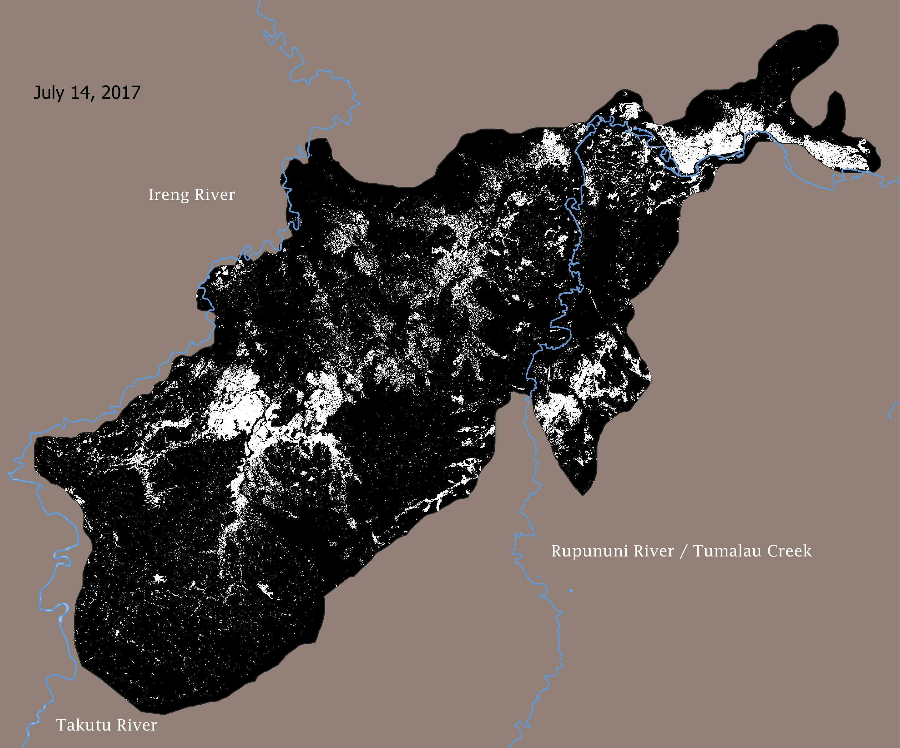

<h1>Guyana Flood Mapping</h1>

<h3>Clark University - Advance Remote Sensing - Spring 2024</h3>
<h3>Project by Clio Bate, Claudia Buszta, Hanxi Li, André de Oliveira, Ruthanne Ward</h3>

Flooding in Rupununi Wetland, July 14 2017

## Environment Setup Instructions for ASF flood mapping notebooks

These instructions guide you through creating and activating environments necessary for running the notebooks in the ASF_Adaptive_Flood_Mapping directory of this repository. All commands should be executed in the terminal. The notebooks were run in Microsoft Planetary Computer but could be run locally.

<h2>Creating Environments</h2>

Create environments based on the specifications provided in the YAML files located in <code>/home/jovyan/GuyanaFloodMapping/configs/</code>. The first line of each step is for the Big_Hand_notebook_adapted notebook for creating a Height Above Nearest Drainage (HAND) geotif. The second line of each step is for the ASF_Flood_mapping notebook, which uses adaptive thresholding to create surface water maps. Execute the following commands in your terminal:

For the <strong>Big_Hand_notebook_adapted</strong> environment:

<pre><code>conda env create -f /home/jovyan/GuyanaFloodMapping/configs/locked_hydrosar_env.yml</code></pre>

For the <strong>ASF_Flood_mapping</strong> environment:

<pre><code>conda env create -f /home/jovyan/GuyanaFloodMapping/configs/SAR_flooding_env.yml</code></pre>

<h2>Steps to Follow After Creating the Environment</h2>

<h3>Step 1: Activate the Environment</h3>

Activate the environment using one of the following commands based on the specific notebook you intend to run:

For <strong>Big_Hand_notebook_adapted</strong>:

<pre><code>conda activate hydrosar</code></pre>

For <strong>ASF_Flood_mapping</strong>:

<pre><code>conda activate asf-jupyter-notebook</code></pre>

Alternatively, you can specify the path directly:

<pre><code>conda activate /home/jovyan/.local/envs/asf-jupyter-notebook</code></pre>

<h3>Step 2: Install IPython Kernel</h3>

With the environment activated, install <code>ipykernel</code> to enable using this environment as a Jupyter kernel. Run the following command for both environments:

<pre><code>conda install ipykernel -y</code></pre>

<h3>Step 3: Register the Kernel</h3>

After installing <code>ipykernel</code>, register the environment as a Jupyter kernel using the commands below:

For <strong>Big_Hand_notebook_adapted</strong>:

<pre><code>python -m ipykernel install --user --name=hydrosar --display-name="Hydrosar"</code></pre>

For <strong>ASF_Flood_mapping</strong>:

<pre><code>python -m ipykernel install --user --name=asf-jupyter-notebook --display-name="SAR Flooding"</code></pre>

This setup will allow you to select the appropriate kernel to run with your notebook from within Jupyter.

